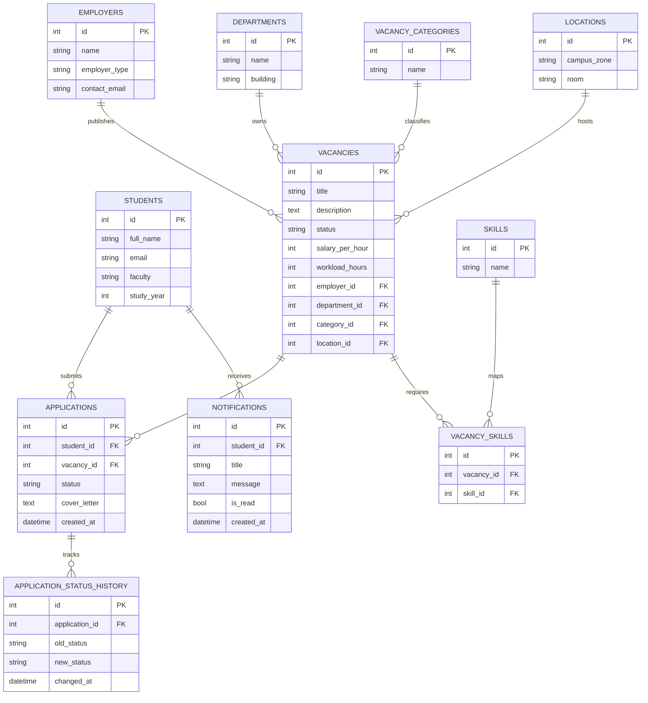

# Архитектура БД (ER-диаграмма)

Ниже визуализация структуры базы данных (11 сущностей):

```mermaid
erDiagram
    STUDENTS ||--o{ APPLICATIONS : submits
    EMPLOYERS ||--o{ VACANCIES : publishes
    DEPARTMENTS ||--o{ VACANCIES : owns
    VACANCY_CATEGORIES ||--o{ VACANCIES : classifies
    LOCATIONS ||--o{ VACANCIES : hosts
    VACANCIES ||--o{ APPLICATIONS : receives
    VACANCIES ||--o{ VACANCY_SKILLS : requires
    SKILLS ||--o{ VACANCY_SKILLS : maps
    APPLICATIONS ||--o{ APPLICATION_STATUS_HISTORY : tracks
    STUDENTS ||--o{ NOTIFICATIONS : receives

    STUDENTS {
      int id PK
      string full_name
      string email
      string faculty
      int study_year
    }
    EMPLOYERS {
      int id PK
      string name
      string employer_type
      string contact_email
    }
    DEPARTMENTS {
      int id PK
      string name
      string building
    }
    VACANCY_CATEGORIES {
      int id PK
      string name
    }
    LOCATIONS {
      int id PK
      string campus_zone
      string room
    }
    VACANCIES {
      int id PK
      string title
      text description
      string status
      int salary_per_hour
      int workload_hours
      int employer_id FK
      int department_id FK
      int category_id FK
      int location_id FK
    }
    SKILLS {
      int id PK
      string name
    }
    VACANCY_SKILLS {
      int id PK
      int vacancy_id FK
      int skill_id FK
    }
    APPLICATIONS {
      int id PK
      int student_id FK
      int vacancy_id FK
      string status
      text cover_letter
      datetime created_at
    }
    APPLICATION_STATUS_HISTORY {
      int id PK
      int application_id FK
      string old_status
      string new_status
      datetime changed_at
    }
    NOTIFICATIONS {
      int id PK
      int student_id FK
      string title
      text message
      bool is_read
      datetime created_at
    }
```
